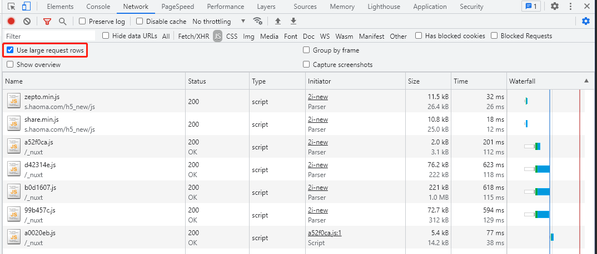

# gzip 压缩


## http 压缩与 gzip

http 压缩指的是 Web 服务器和浏览器之间压缩传输**文本内容**的方法，对传输内容进行压缩可以提高网页加载资源的速度，同时会增加服务器的开销。

gzip 是 http 压缩采用的一种压缩算法。

## gzip 压缩过程

1. 客户端 http 请求头中用 Accept-Encoding 字段声明浏览器支持的压缩方式，如 `Accept-Encoding:gzip`。
2. 服务端配置启用压缩，压缩的文件类型，压缩方式。
3. 服务端接收到请求时解析请求头，如果客户端支持 gzip 压缩，响应时对请求的资源进行压缩并返回给客户端，响应头中加入 content-encoding 字段表示压缩方式 `content-encoding:gzip`。
4. 浏览器接收到响应时按照 Content-Encoding 传递的方式解码并使用资源。

## gzip 优缺点

gzip 压缩后可以提高资源传输效率，但是会提高对服务器的负担。

在传输过程中压缩文件耗费 CPU 但是节省带宽（用空间换时间）。

gzip 无法压缩图片。

## 在 chrome 浏览器中查看 gzip 压缩效果

在 chrome 浏览器的 network 标签中可以看到加载 js 文件的请求，size 列中上面数值表示经过压缩后的文件大小，下面的数值表示源文件大小。



## 如何启用 gzip

对于客户端来说只需要确定浏览器是否支持 gzip 压缩并在打包工具中设置打包方式正确生成 gz 文件即可，启用 gzip 主要在服务端。

### webpack

在 webpack 中配置 gzip 压缩。

```js
const CompressionWebpackPlugin = require("compression-webpack-plugin");
plugins.push(
  new CompressionWebpackPlugin({
    asset: "[path].gz[query]", // 目标文件名
    algorithm: "gzip", // 使用gzip压缩
    test: new RegExp(
      "\\.(js|css)$" // 压缩 js 与 css
    ),
    threshold: 10240, // 资源文件大于10240B=10kB时会被压缩
    minRatio: 0.8, // 最小压缩比达到0.8时才会被压缩
  })
);
```

### express

在 express 中启用 gzip：

```js
var compression = require("compression");
var app = express();

//尽量在其他中间件前使用compression
app.use(compression());
```

对请求进行过滤：

```js
app.use(compression({ filter: shouldCompress }));

function shouldCompress(req, res) {
  if (req.headers["x-no-compression"]) {
    // 这里就过滤掉了请求头包含'x-no-compression'
    return false;
  }
  return compression.filter(req, res);
}
```

### nginx

在 nginx 中配置开启 gzip 压缩。

gzip 使用环境：http，server，location，if(x)，一般把它定义在 nginx.conf 的 http{……}之间。

```conf
gzip on
# on为启用，off为关闭
gzip_min_length 1k
# 设置允许压缩的页面最小字节数，页面字节数从header头中的Content-Length中进行获取。默认值是0，不管页面多大都压缩。建议设置成大于1k的字节数，小于1k可能会越压越大。
gzip_buffers 4 16k
# 获取多少内存用于缓存压缩结果，‘4 16k’表示以16k*4为单位获得
gzip_comp_level 5
# gzip压缩比（1~9），越小压缩效果越差，但是越大处理越慢，所以一般取中间值;
gzip_types text/plain application/x-javascript text/css application/xml text/javascript application/x-httpd-php
# 对特定的MIME类型生效,其中'text/html'被系统强制启用
gzip_http_version 1.1
# 识别http协议的版本,早起浏览器可能不支持gzip自解压,用户会看到乱码
gzip_vary on
# 启用应答头"Vary: Accept-Encoding"
gzip_proxied off
# nginx做为反向代理时启用
# off(关闭所有代理结果的数据的压缩)
# expired(启用压缩,如果header头中包括"Expires"头信息)
# no-cache(启用压缩,header头中包含"Cache-Control:no-cache")
# no-store(启用压缩,header头中包含"Cache-Control:no-store")
# private(启用压缩,header头中包含"Cache-Control:private")
# no_last_modefied(启用压缩,header头中不包含"Last-Modified")
# no_etag(启用压缩,如果header头中不包含"Etag"头信息)
# auth(启用压缩,如果header头中包含"Authorization"头信息)
gzip_disable msie6
# (IE5.5和IE6 SP1使用msie6参数来禁止gzip压缩 )指定哪些不需要gzip压缩的浏览器(将和User-Agents进行匹配),依赖于PCRE库
```

## 参考

[前端性能优化之 gzip](https://www.cnblogs.com/style-hyh/p/10395410.html)

[HTTP 压缩开启 gzip](https://www.cnblogs.com/LO-ME/p/7377082.html)
